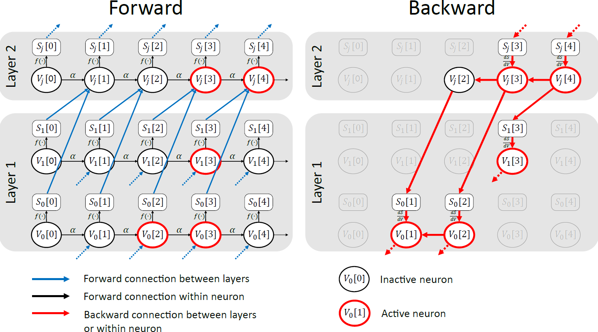
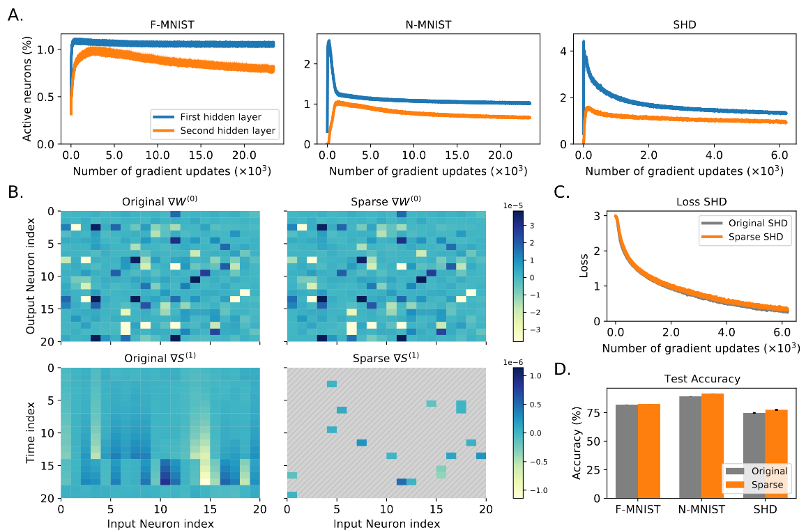
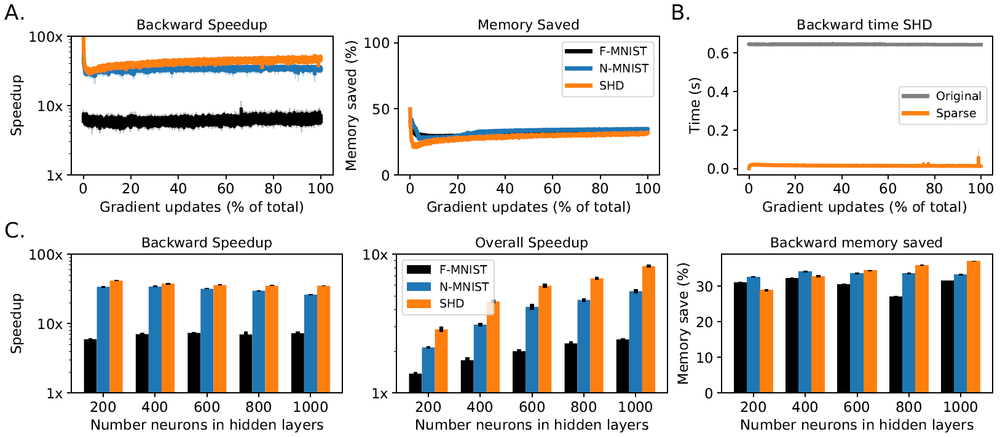
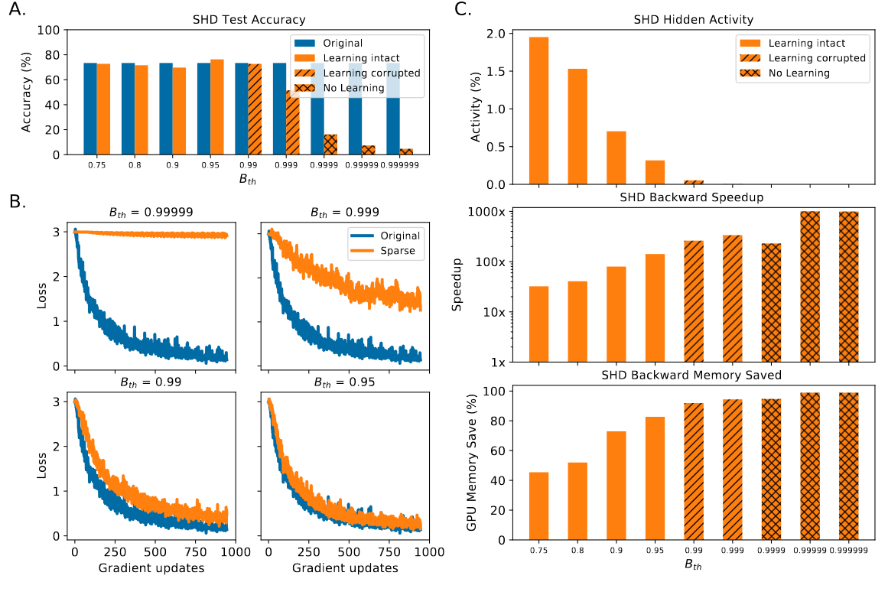

# Sparse Spiking Gradient Descent

A sparse gradient descent method for spiking neural networks that runs backpropagation up to 150x faster with up to 85% less memory. 
Link to article: https://proceedings.neurips.cc/paper/2021/hash/61f2585b0ebcf1f532c4d1ec9a7d51aa-Abstract.html



Citation:
```
@article{perez2021sparse,
  title={Sparse Spiking Gradient Descent},
  author={Perez-Nieves, Nicolas and Goodman, Dan FM},
  journal={Advances in Neural Information Processing Systems},
  year={2021} }
```

## Requirements

Required:
* A CUDA capable GPU with [CUDA 11.0](https://developer.nvidia.com/cuda-11.0-download-archive) installed
* [pyTorch 1.7.1](https://pytorch.org/get-started/previous-versions/#v171)
* [GCC >=5](https://gcc.gnu.org/) or equivalent C++ compiler

Optional:
* [matplotlib](https://matplotlib.org/stable/users/installing.html) (for plotting results)
* [scipy](https://matplotlib.org/stable/users/installing.html) (for plotting results)
* [pytables](https://www.pytables.org/usersguide/installation.html) (for reading .h5 files for SHD and N-MNIST datasets)

(We developed our code on pyTorch 1.7.1 and CUDA 11.0 but it should also work on other versions)

## Detailed setup

We assumme you have a CUDA capable GPU with [CUDA installed](https://docs.nvidia.com/cuda/). 

Create a new [Anaconda](https://docs.anaconda.com/anaconda/install/) environment and install the dependencies

```setup
conda env create -f environment.yml
```

Activate the environment
```setup
conda activate s3gd
```

Then install the torch extension. 
```setup
cd cuda
python setup_s3gd_cuda.py install
```

This should install the extension. If everything went fine you should end up getting something similar to 
```
...

Installed /home/USERNAME/.conda/envs/s3gd/lib/python3.8/site-packages/s3gd_cuda-0.0.0-py3.8-linux-x86_64.egg
Processing dependencies for s3gd-cuda==0.0.0
Finished processing dependencies for s3gd-cuda==0.0.0
```
You can test that the installation was successful by running the following
```
python
>>> import torch
>>> import s3gd_cuda
```

## Running 
You can now run the code
```
cd ..
python main.py
```

This will run with the Fashion-MNIST dataset by default.

If you wish to run the Spiking Heidelberg Digits (SHD) dataset you can [download](https://compneuro.net/posts/2019-spiking-heidelberg-digits/) it.
Then save the `train_shd.h5` and `test_shd.h5` in `datasets/SHD`.

You can also [download](https://www.garrickorchard.com/datasets/n-mnist) the Neuromorphic-MNIST dataset and convert the raw spikes into .h5 format. 
After downloading `Train.zip` and `Test.zip`, unzip them and copy the directories to `datasets/nmnist`. 
Then run

```
python datasets/nmnist/convert_nmnist2h5.py
```

Now you can specify the dataset that you wish to run
```
python main.py --dataset fmnist
python main.py --dataset nmnist
python main.py --dataset SHD
```

You can also find the code for the plots in the paper under the `plotting` direcctory. 
We included the results for a single seed so that it can be run with either `python final_plots.py` for the main text plots or `python supp_plots.py` for the supplementary plots. Note that the SHD results in the provided data were obtained by using max-over-time on the readout layer instead of sum-over-time which is necessary to obtain the 75+%  accuracy. The 75+% SHD data can be found in `plotting/results_bth`.

## Results

### Spiking neurons are inactive most of the time and yet the gradient is well approximated



* A. Percentage of active neurons during training as a fractionof total tensor size (BxTxN) with N=200 neurons for each dataset. 
* B. Visualisation of weight and spike gradients on the SHD dataset. Zero values are shown in hatched grey. Note how the ∇W is nearly identical in both cases despite being computed using a small fraction of the values of ∇S in the sparse case.
* C. Loss evolution on the SHD dataset using both algorithms.
* D. Final test accuracyon all datasets using both methods

###  Sparse training is faster and less memory intensive




* A. Backwardspeedup and memory saved in the second hidden layer for all three datasets when using sparsegradient descent with 200 hidden neurons.

* B. Time spent in computing the backward pass in thesecond hidden layer consisting of 200 neurons when using regular gradient descent and sparsegradient descent.

* C. Backward speed and memory saved in the second hidden layer as we increasethe number of hidden neurons in all hidden layers. We included the overall speedup which takes intoconsideration both the forward and backward times spent in the second layer.


###  Sparsity-Accuracy trade-off




* A.  Final test accuracy on the SHD dataset as  increases.

* B. Loss evolution on the SHD dataset for different  .

* C. Hidden activity, backward speedup and backward memory saved as   increases.


